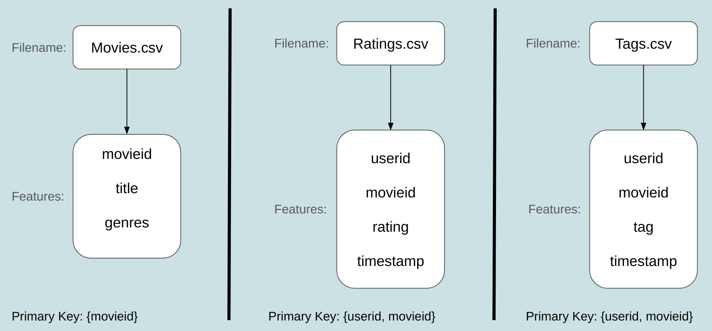
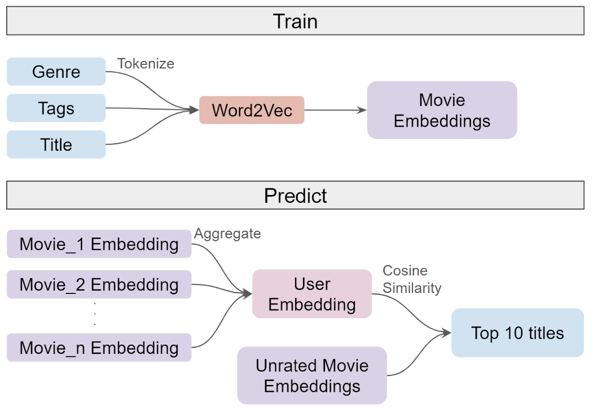
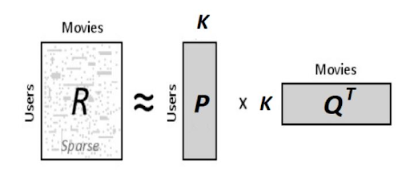
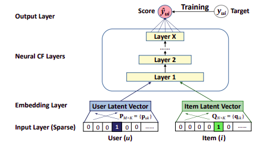
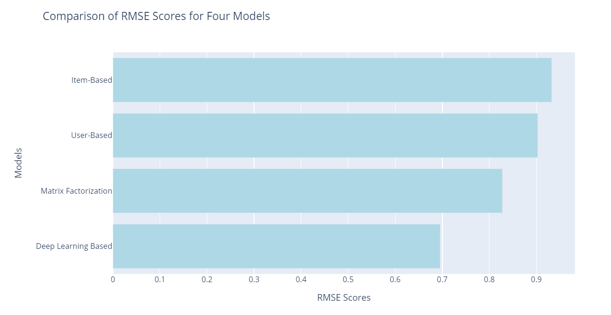

# Movie Recommendation System

## Problem Definition: 
Our project focuses on the development of a sophisticated movie recommendation system, aimed at enhancing user experience and engagement within the context of contemporary businesses. Leveraging the power of recommendation algorithms, we aim to provide a comprehensive and user-friendly platform that adapts to evolving customer preferences. The primary objectives are to optimize user satisfaction, boost user retention rates, and align with the dynamic tastes of our customer base.

Tryout the hosted version of this app [here](https://movie-reco-siva.streamlit.app/)

## Dataset

Movie Lens 25M [Dataset](https://grouplens.org/datasets/movielens/25m/) has been used for recommending movies to the user.\
Download the above dataset and place it in the folder named dataset.

Three datasets are used in this project: ratings.csv, movies.csv and tags.csv. 




## Algorithms
### Content-Based Filtering using NLP
Content-based filtering is another approach used in recommendation systems, and it relies on the characteristics or features of items and users to make recommendations. Unlike collaborative filtering, content-based filtering doesn't require information about the preferences or behaviors of other users. Instead, it focuses on the properties of items and the explicit profile of the user.

**Word2Vec Training:**\
Tokenize movie tags and train a Word2Vec model with specified parameters, such as vector size and window size. This process generates embeddings that capture semantic relationships within the textual content.

**Movie Embeddings:**\
Compute unique embeddings for each movie using the trained Word2Vec model. These embeddings represent the semantic content of the movies.

**User Embeddings:**\
Determine user embeddings by aggregating the embeddings of rated movies, reflecting individual preferences in the Word2Vec space.

**Cosine Similarity for Recommendations:**\
Utilize cosine similarity to measure the similarity between user and movie embeddings.
Recommend movies with the highest cosine similarity scores, aligning with user preferences.

#### Model architecture


### User-Based Collaborative Filtering:

#### Matrix Factorization
Matrix factorization stands out as a widely used technique for collaborative filtering. The fundamental concept involves breaking down the user-item matrix into two matrices with lower ranks: one depicting user preferences and the other reflecting movie characteristics. The reconstruction of the original user-item matrix is accomplished by computing the dot product of these two matrices.


#### Deep learning Based
The construction of the Deep Neural Network model involved extracting the latent features of users and movies using Embedding layers. 



## Results
The performance of the movie prediction models was rigorously evaluated using RMSE (Root Mean Square Error) as the benchmark metric, comparing true ratings against predicted ratings. The following is a summary of the results:


## Usage
On the terminal run the below command to launch streamlit:
```shell
streamlit run .\streamlit_app\movie_recommendation_system.py
```
The app will be available on http://localhost:8501/